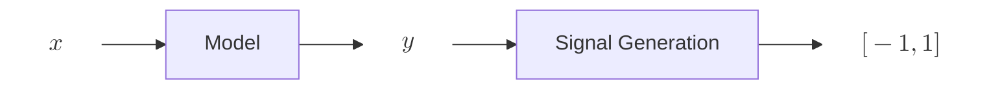

import { Mermaid } from '@/components/mermaid';

## Alpha

One way to conceptualise an **alpha** is to outline its processes and model our understanding around its behaviour. The 
figure below depicts an overview of how an alpha behaves particularly on how it process data and eventually turn them 
into trading signals.

> 
$$x$$ = input data $$y$$ = model data

**Model** and **Signal Generation** in this scenario can be thought as mathematical functions albeit their signatures are 
not necessarily the same. Note that $$x$$ can be any data (for eg. market data, on-chain events, etc.) and the exact structure of $$y$$ is 
not restricted, it is up to the implementor to decide how to translate $$y$$ into signals later.

### Model

**Model** can be any of the following functions:
- $$f(x) \to y$$
- $$f(x) \to y_1, \;y_2, \;y_n$$
- $$f(x_1, \;x_2, ... \;x_n) \to y$$
- $$f(x_1, \;x_2, ... \;x_n) \to y_1, \;y_2, ... \;y_n$$

Note that from the possible signatures, it implies that $$x$$ can be a singular data or multiple data hence it is possible 
for an **alpha** to utilise multiple data sources as input to its model. For example, a simple model

$$y = x_1 - x_2$$

> 
$$x_1$$ = BTC price on Exchange A   $$x_2$$ = BTC price on Exchange B

In this case, the model computes the difference in price across Exchange A and Exchange B.

### Signal Generation

**Signal Generation** can be any of the following functions:
- $$f(y) \to [-1,1]$$
- $$f(y_1, \;y_2, ... \;y_n) \to [-1,1]$$

A trading signal to put simply is a real number ranging between $$-1$$ to $$1$$ where negative number implies a sell 
position, positive number implies a buy position and $$0$$ is a special number to indicate empty position. 

The input of the signal generator fits specifically to how one's $$y$$ (model data) is structured hence why it can take 
$$y$$ or $$y_1, y_2, ... y_n$$. The only specification is that it must return a number between $$[-1,1]$$ to indicate its 
confidence level on future price going up / down.