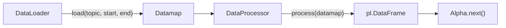

import { Mermaid } from '@/components/mermaid';
import { Accordions, Accordion } from 'fumadocs-ui/components/accordion';

## Overview

The data layer in ADRS handles fetching, caching, and normalising market data from upstream providers. It is built
around two primary abstractions:

- **`DataLoader`** — fetches raw data from a provider (or your own source) and caches results to disk.
- **`Datamap`** — an in-memory store that holds aligned, processed data ready for use in an alpha.



---

## DataInfo

`DataInfo` describes a single data source that an alpha requires. It specifies which data topic to load, which columns
to keep, and how many additional historical bars are needed before the start of the backtest (the *lookback*).

```py
from adrs.data import DataInfo, DataColumn

DataInfo(
    topic="binance-spot|candle?symbol=BTCUSDT&interval=1h",
    columns=[DataColumn(src="close", dst="close_binance")],
    lookback_size=100,  # extra historical bars needed for warm-up
)
```

| Field | Type | Description |
|---|---|---|
| `topic` | `str` | Data topic string understood by the DataLoader (see [topic format](#topic-format)) |
| `columns` | `list[DataColumn]` | Column mappings from source → destination name |
| `lookback_size` | `int` | Number of extra historical bars to prepend for indicator warm-up |

### DataColumn

`DataColumn` renames a source column to a destination name in the output DataFrame.

```py
DataColumn(src="close", dst="close_binance")
```

| Field | Type | Description |
|---|---|---|
| `src` | `str` | Column name in the raw source data (e.g. `"close"`) |
| `dst` | `str` | Column name in the merged DataFrame (must be unique across all `DataInfo` objects) |

### Topic format 

Topics follow the pattern `<provider>|<endpoint>?<params>`:

```
binance-spot|candle?symbol=BTCUSDT&interval=1h
bybit-linear|candle?symbol=BTCUSDT&interval=1m
coinbase|candle?symbol=BTCUSD&interval=1h
yfinance|candle?ticker=SPY&interval=1d
custom|my-endpoint
```

Supported providers can be found in the [datasource docs](http://docs.datasource.cybotrade.rs/). For custom providers, 
they are resolved by the registered handlers in your `DataLoader`.

---

## DataLoader

`DataLoader` is the entry-point for fetching data. By default it talks to the **Datasource** API, but it is designed
to be extended with your own handlers for any data source.

```py
import os
from adrs import DataLoader

dataloader = DataLoader(
    data_dir="outdir",                              # local cache directory
    credentials={"cybotrade_api_key": os.environ["USER_ID"]},
    cybotrade_api_url=os.environ["DATASOURCE_PROXY_URL"], # {"cybotrade_api_key": "..."}
)
```

### Constructor

```py
DataLoader(
    data_dir: str,
    credentials: dict[str, str] | None = None,
    format: str | None = None,
    use_cybotrade_datasource: bool | None = None,
    cybotrade_api_url: str | None = None,
    handlers: list[Handler] = [],
)
```

| Parameter | Type | Description |
|---|---|---|
| `data_dir` | `str` | Directory where downloaded data is cached |
| `credentials` | `dict` | API credentials, e.g. `{"cybotrade_api_key": "..."}` |
| `handlers` | `list[Handler]` | Custom data handlers (see below) |

### Loading data

```py
df = await dataloader.load(
    topic="binance-spot|candle?symbol=BTCUSDT&interval=1h",
    start_time=datetime.fromisoformat("2024-01-01T00:00:00Z"),
    end_time=datetime.fromisoformat("2025-01-01T00:00:00Z"),
)
```

Results are automatically cached to `data_dir` so subsequent calls with the same topic and time range are instant.

---

## Custom Handlers

A **handler** is an `async` function that intercepts a topic and returns a `pl.DataFrame` (or `None` to pass through
to the next handler). This makes it straightforward to pull data from any source — local files, third-party APIs,
databases, etc.

### Handler signature

```py
from datetime import datetime
import polars as pl

async def my_handler(
    topic: str,
    start_time: datetime,
    end_time: datetime,
) -> pl.DataFrame | None:
    ...
```

The returned DataFrame **must** contain a `start_time` column with dtype `pl.Datetime("ms", time_zone="UTC")`.
Return `None` if the handler does not recognise the topic so ADRS falls through to the next handler.

### Example — loading from a local file

```py
async def local_handler(topic: str, start_time: datetime, end_time: datetime):
    if topic != "custom|btc-1h":
        return None  # not our topic — pass through

    return pl.read_parquet("data/btc_1h.parquet")

dataloader = DataLoader(
    data_dir="outdir",
    credentials={"cybotrade_api_key": os.environ["USER_ID"]},
    cybotrade_api_url=os.environ["DATASOURCE_PROXY_URL"],
    handlers=[local_handler],
)

df = await dataloader.load(
    topic="custom|btc-1h",
    start_time=start_time,
    end_time=end_time,
)
```

### Built-in handler — yfinance

ADRS ships with a ready-made handler for [Yahoo Finance](https://finance.yahoo.com) data:

```py
from adrs.data.handler import yfinance_handler

dataloader = DataLoader(
    data_dir="outdir",
    credentials={"cybotrade_api_key": os.environ["USER_ID"]},
    cybotrade_api_url=os.environ["DATASOURCE_PROXY_URL"],
    handlers=[yfinance_handler],
)

df = await dataloader.load(
    topic="yfinance|candle?ticker=SPY&interval=1d",
    start_time=datetime.fromisoformat("2020-01-01T00:00:00Z"),
    end_time=datetime.fromisoformat("2025-01-01T00:00:00Z"),
)
```

Supported `interval` values match those accepted by `yfinance`: `1m`, `5m`, `15m`, `30m`, `1h`, `1d`, `1wk`, `1mo`.

<Accordions>
  <Accordion id='multiple-handlers' title="Using multiple handlers together">
    Handlers are tried in order. The first handler that returns a non-`None` value wins. This lets you layer custom
    sources on top of the default Datasource:

    ```py
    dataloader = DataLoader(
        data_dir="outdir",
        credentials={"cybotrade_api_key": os.environ["USER_ID"]},
    cybotrade_api_url=os.environ["DATASOURCE_PROXY_URL"],
        handlers=[my_custom_handler, yfinance_handler],
    )
    ```
  </Accordion>
</Accordions>
