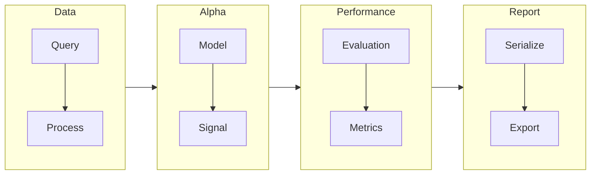

import { Mermaid } from '@/components/mermaid';

## Workflow

The diagram below shows a general flowchart of the research process, of course since ADRS is built to be composable, users 
can use the components freely to build their own research workflow too. Hence your use case might slightly differ from 
this process but for the sake of learning, we will assume this for the rest of the guide. 

There are four main components: **Data**, **Alpha**, **Performance** and **Report** and we will further explore each component 
in details in later sections.

### Data

Handles querying data from upstream data providers and provide tools for pagination, caching, etc. By default, [Datasource](https://docs.datasource.cybotrade.rs)
is used but it is possible to implement your custom handler interacting with other data providers. For your information, 
[Datasource](https://docs.datasource.cybotrade.rs) is a data aggregator / provider service at [Balaena Quant](https://www.balaenaquant.com), 
note that most of the data are proprietary thus it is recommended that you write your own handler for data that are not 
freely available.

In addition, it also provides primitives for users to build their own **Data Proccessor** which is used to handle multiple data sources, 
for example when an alpha requires hourly data from *Glassnode* but also requires 15 minute data from *Binance* then there 
has to be some sort of upsampling / downsampling, this is where users define their desired behaviour when writing their 
data processors.

For more details read [data](/docs/adrs/data).

### Alpha

This component provide a base class `Alpha` for users to extend from such that they can build their own models around the
data and to write their desired logic for transforming these model data into a trading signal.

For more details read [alpha](/docs/adrs/alpha/concept).

### Performance

By default, an alpha only produces the signal at every time step hence the profit and loss (P&L) is not computed at the
time of signal generation. Hence, usually the computed signals are then passed into an `Evaluator` along with the price
data to be used where the `Evaluator` then evaluate the *P&L* of the alpha at each time step based on the given price.

From the *P&L* of the alpha, various metrics can be then derived from it for example, the well-known **Sharpe Ratio**.
Of course, it is possible to also derive other metrics such as **Calmar Ratio**, **Max Drawdown**, **Compound Annual Growth Rate (CAGR)**, etc.

For more details read [performance](/docs/adrs/performance).

### Report

For more details read [report](/docs/adrs/report).
