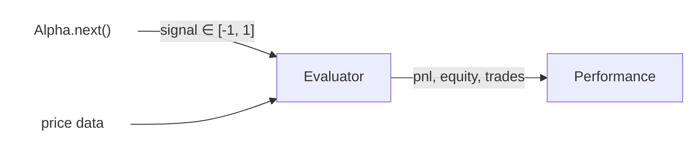

import { Mermaid } from '@/components/mermaid';

## Overview

The performance layer takes the **signals** produced by an alpha and converts them into a full P&L timeseries, from
which all metrics — Sharpe ratio, drawdown, win rate, and more — are derived.



---

## Evaluator

`Evaluator` maps each tradeable asset to a `DataInfo` that contains a `price` column. During a backtest, it
cross-joins the signal output with the corresponding price series to compute the per-bar P&L.

### Construction

```py
from adrs.performance import Evaluator
from adrs.data import DataInfo, DataColumn

evaluator = Evaluator(
    assets={
        "BTC": DataInfo(
            topic="bybit-linear|candle?symbol=BTCUSDT&interval=1m",
            columns=[DataColumn(src="close", dst="price")],
            lookback_size=0,
        ),
    }
)
```

<Callout type="warn" title="price column is mandatory">
  Every `DataInfo` passed to `Evaluator` must map a source column to the destination name **`price`**. If the column
  is missing ADRS will raise a validation error.
</Callout>

The key in `assets` (e.g. `"BTC"`) must match the `base_asset` you pass when calling `alpha.backtest()`.

### Multi-asset evaluators

A single `Evaluator` instance can hold price data for many assets at once. This is the recommended approach when
running a `Portfolio`:

```py
evaluator = Evaluator(
    assets={
        "BTC": DataInfo(
            topic="bybit-linear|candle?symbol=BTCUSDT&interval=1m",
            columns=[DataColumn(src="close", dst="price")],
            lookback_size=0,
        ),
        "ETH": DataInfo(
            topic="binance-spot|candle?symbol=ETHUSDT&interval=1m",
            columns=[DataColumn(src="close", dst="price")],
            lookback_size=0,
        ),
    }
)
```

---

## Running a backtest

Call `alpha.backtest()` to evaluate a single alpha end-to-end:

```py
performance, df = alpha.backtest(
    evaluator=evaluator,
    base_asset="BTC",
    datamap=datamap,
    start_time=start_time,
    end_time=end_time,
    fees=0.035,         # basis points (bps)
    price_shift=10,     # candles of execution delay (e.g. 10 min @ 1m bars)
)
```

### Arguments

| Parameter | Type | Default | Description |
|---|---|---|---|
| `evaluator` | `Evaluator` | — | Holds asset price data |
| `base_asset` | `str` | — | Asset key that maps into `evaluator.assets` |
| `datamap` | `Datamap` | — | Loaded data store |
| `start_time` | `datetime` | — | Backtest window start |
| `end_time` | `datetime` | — | Backtest window end |
| `fees` | `float` | — | Round-trip trading fees in basis points |
| `data_df` | `pl.DataFrame \| None` | `None` | Pre-processed DataFrame (skip re-processing if provided) |
| `price_shift` | `int` | `0` | Simulate execution lag — shift price N candles forward |
| `output_columns` | `list[pl.Expr]` | `[pl.all()]` | Polars expressions selecting extra output columns |

### Return value

`alpha.backtest()` returns a tuple of `(Performance, pl.DataFrame)`:

- **`Performance`** — a Pydantic model containing all summary metrics ([see Metrics](/docs/adrs/performance/metrics)).
- **`pl.DataFrame`** — the full per-bar backtest result with the following columns:

| Column | Type | Description |
|---|---|---|
| `start_time` | `Datetime[ms, UTC]` | Bar timestamp |
| `price` | `Float64` | Asset price |
| `signal` | `Float64` | Position signal ∈ [-1, 1] |
| `prev_signal` | `Float64` | Previous bar's signal |
| `trade` | `Float64` | Trade flag (non-zero when position changes) |
| `pnl` | `Float64` | Per-bar profit & loss |
| `equity` | `Float64` | Cumulative equity curve |

---

## fees and price_shift

### fees

`fees` is expressed in **basis points** (bps). For example, `fees=0.035` corresponds to 3.5 bps per trade.
Fees are deducted on every position change.

### price_shift

`price_shift` simulates **execution latency**. Setting `price_shift=10` with 1-minute bars means the backtest
assumes your order fills 10 minutes after the signal is generated. Use this to model realistic slippage and avoid
look-ahead bias.

```py
# Signal generated at close of bar N → order fills at close of bar N+10
performance, df = alpha.backtest(..., price_shift=10)
```
