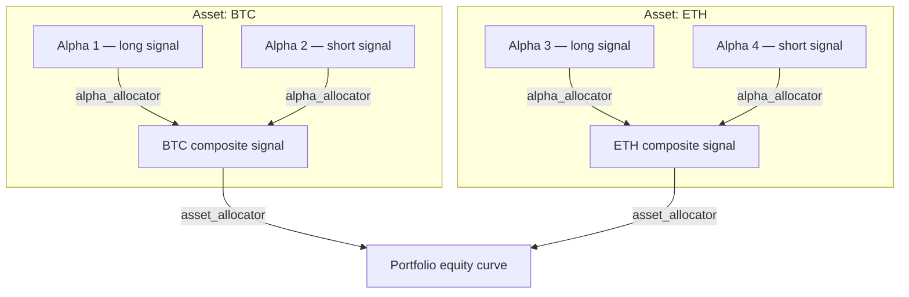

import { Mermaid } from '@/components/mermaid';

## Overview

A `Portfolio` groups one or more alphas per asset, combines their signals using an **alpha weight allocator**, and then
combines the per-asset results using an **asset weight allocator**. This two-level allocation hierarchy lets you
express complex multi-asset, multi-signal strategies in a clean, composable way.



---

## Asset

`Asset` is a dataclass that binds a list of alphas to a single tradeable instrument.

```py
from adrs.portfolio import Asset

Asset(
    name="BTC",                     # matches a key in evaluator.assets
    alphas=[long_alpha, short_alpha],
    fees=0.035,                      # bps, applied to every alpha in this asset
    price_shift=10,                  # execution lag in candles
    allocator=mean_alpha_allocator,  # how to weight each alpha's signal
)
```

| Field | Type | Default | Description |
|---|---|---|---|
| `name` | `str` | — | Asset identifier, must match a key in `Evaluator.assets` |
| `alphas` | `list[Alpha]` | — | Alphas to run for this asset |
| `fees` | `float` | — | Round-trip fees in basis points |
| `price_shift` | `int` | `0` | Execution delay in number of candles |
| `allocator` | `AlphaWeightAllocator` | `mean_alpha_allocator` | Weighting function across alphas |

---

## Portfolio

`Portfolio` accepts a list of `Asset` objects and runs a full backtest across all assets and all alphas within them.

### Constructor

```py
from adrs.portfolio import Portfolio

portfolio = Portfolio(
    id="my_portfolio",
    start_time=start_time,
    end_time=end_time,
    datamap=datamap,
    evaluator=evaluator,
    assets=[btc_asset, eth_asset],
    asset_allocator=mean_asset_allocator,
)
```

| Parameter | Type | Default | Description |
|---|---|---|---|
| `id` | `str` | — | Unique portfolio identifier |
| `start_time` | `datetime` | — | Backtest window start |
| `end_time` | `datetime` | — | Backtest window end |
| `datamap` | `Datamap` | — | Loaded data store |
| `evaluator` | `Evaluator` | — | Provides price data for all assets |
| `assets` | `list[Asset]` | — | Constituent assets |
| `asset_allocator` | `AssetWeightAllocator` | `mean_asset_allocator` | Weighting function across assets |

### Running a backtest

```py
portfolio_performance, df = portfolio.backtest()
```

To inspect individual asset performance:

```py
asset_performances = portfolio.backtest_asset()
# Returns: dict[str, tuple[Performance, pl.DataFrame]]
```

---

## Allocators

Allocators are plain Python callables that translate backtest results into decimal weights. ADRS ships with two
built-in allocators, and you can easily write your own.

### Alpha weight allocators

An `AlphaWeightAllocator` maps `AlphaPerformances` → `AlphaWeights`:

```py
AlphaPerformances = dict[str, tuple[Performance, pl.DataFrame]]
AlphaWeights      = dict[str, Decimal]
```

**`mean_alpha_allocator`** (built-in) — equal weight across all alphas:

```py
from adrs.portfolio import mean_alpha_allocator
```

**Custom example — weight by Sharpe ratio:**

```py
from decimal import Decimal
from adrs.portfolio import AlphaPerformances, AlphaWeights

def sharpe_allocator(performances: AlphaPerformances) -> AlphaWeights:
    sharpes = {id: max(perf.sharpe_ratio, 0) for id, (perf, _) in performances.items()}
    total = sum(sharpes.values()) or 1
    return {id: Decimal(str(s / total)) for id, s in sharpes.items()}
```

### Asset weight allocators

An `AssetWeightAllocator` maps `dict[str, AlphaGroup]` → `AssetWeights`:

```py
AssetWeights = dict[str, Decimal]
```

**`mean_asset_allocator`** (built-in) — equal weight across all assets.

**Custom example — fixed 80/20 BTC/ETH split:**

```py
from decimal import Decimal

portfolio = Portfolio(
    ...
    asset_allocator=lambda _: {"BTC": Decimal("0.8"), "ETH": Decimal("0.2")},
)
```

---

## Full example

```py
import os, asyncio
from decimal import Decimal
from datetime import datetime
from adrs import DataLoader
from adrs.performance import Evaluator
from adrs.data import DataInfo, DataColumn, make_datamap
from adrs.portfolio import Portfolio, Asset, mean_alpha_allocator
from adrs.utils import backforward_split
from adrs.report.portfolio import PortfolioReportV1

async def main():
    start_time = datetime.fromisoformat("2024-01-01T00:00:00Z")
    end_time   = datetime.fromisoformat("2025-01-01T00:00:00Z")

    dataloader = DataLoader(
        data_dir="outdir",
        credentials={"cybotrade_api_key": os.getenv("DATASOURCE_API_KEY")},
    )
    evaluator = Evaluator(assets={
        "BTC": DataInfo(
            topic="bybit-linear|candle?symbol=BTCUSDT&interval=1m",
            columns=[DataColumn(src="close", dst="price")],
            lookback_size=0,
        ),
        "ETH": DataInfo(
            topic="binance-spot|candle?symbol=ETHUSDT&interval=1m",
            columns=[DataColumn(src="close", dst="price")],
            lookback_size=0,
        ),
    })

    btc_alphas = [long_btc_alpha, short_btc_alpha]
    eth_alphas = [long_eth_alpha, short_eth_alpha]

    datamap = await make_datamap(
        dataloader=dataloader,
        data_infos=btc_alphas[0].data_infos + eth_alphas[0].data_infos,
        start_time=start_time,
        end_time=end_time,
        evaluator=evaluator,
    )

    portfolio = Portfolio(
        id="my_portfolio",
        start_time=start_time,
        end_time=end_time,
        datamap=datamap,
        evaluator=evaluator,
        assets=[
            Asset(name="BTC", alphas=btc_alphas, fees=0.035, price_shift=10,
                  allocator=mean_alpha_allocator),
            Asset(name="ETH", alphas=eth_alphas, fees=0.035, price_shift=10,
                  allocator=mean_alpha_allocator),
        ],
        asset_allocator=lambda _: {"BTC": Decimal("0.8"), "ETH": Decimal("0.2")},
    )

    B_start, B_end, F_start, F_end = backforward_split(
        start_time=start_time, end_time=end_time, size=(0.7, 0.3)
    )
    report = PortfolioReportV1.compute(
        portfolio=portfolio,
        B_start=B_start, B_end=B_end,
        F_start=F_start, F_end=F_end,
    )
    print(report.back.performance)

asyncio.run(main())
```
